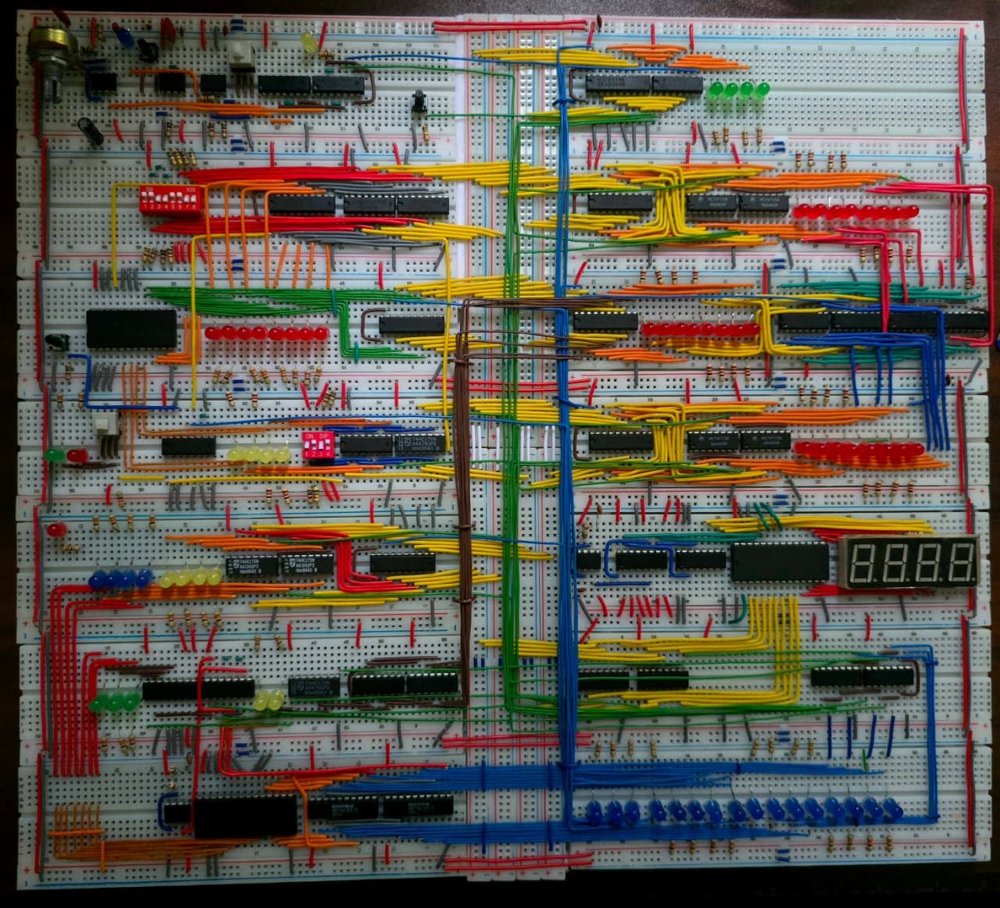

# Glassbox 8-Bit Breadboard Computer & SystemVerilog Core

An 8-bit breadboard computer architecture built using discrete 74LS series logic gates, paired with a custom SystemVerilog behavioral model and cycle-accurate FPGA testbenches.

---

## 📸 System Overview

  

## 🏗️ Architecture & Features

* **Bus Architecture:** 8-bit single bidirectional shared bus structure.
* **Control Unit:** EEPROM-based microcode decoder supporting multi-cycle instructions.
* **Registers:** Dedicated 8-bit registers ($A$, $B$, Instruction Register, Output Register).
* **Execution:** Hardware ALU capable of addition, subtraction, and status flag generation ($Z$, $C$).
* **Simulation & Hardware Verification:** Fully modeled in Logisim and SystemVerilog with Vivado timing waveforms.
